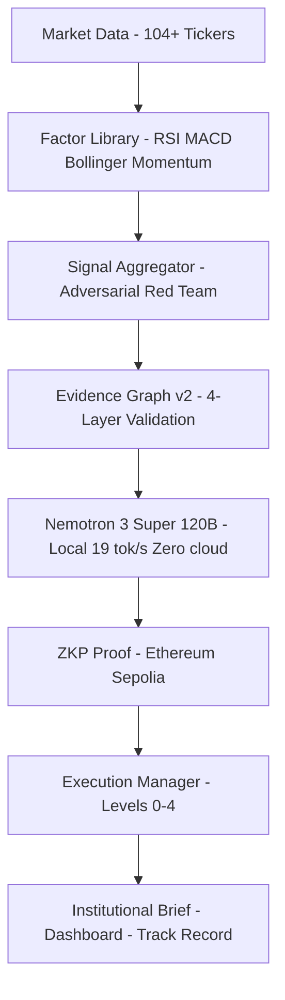

<div align="center">

# YUCLAW

**Open Financial Intelligence Platform**

[](https://opensource.org/licenses/MIT)
[](https://www.python.org/downloads/)
[](https://pypi.org/project/yuclaw)
[](https://nvidia.com)
[](https://sepolia.etherscan.io)
[](https://papers.ssrn.com/sol3/papers.cfm?abstract_id=6461418)

> The open-source financial intelligence OS. Real backtests. ZKP audit trail. Local 120B AI.
> Like OpenClaw, but strictly built for institutional finance.

[Live Dashboard](https://yuclawlab.github.io/yuclaw-brain) · [Academic Paper](https://papers.ssrn.com/sol3/papers.cfm?abstract_id=6461418) · [Twitter](https://twitter.com/Vincenzhang2026) · [PyPI](https://pypi.org/project/yuclaw)

</div>

---

## Quick Start
```bash
pip install yuclaw
yuclaw today
```

Output:
```
YUCLAW Daily Brief — 2026-03-27
==================================================

MARKET: CRISIS (90% confidence)
   Maximum cash
   TLT + GLD only

TOP BUY SIGNALS:
   LUNR   STRONG_BUY   score:+0.650 price:$19.23
   ASTS   STRONG_BUY   score:+0.687 price:$87.00
   DELL   STRONG_BUY   score:+0.674 price:$176.91

TRACK RECORD: Day 5 accuracy 67%

PORTFOLIO ACTION:
   Hold 80%+ cash. Buy only highest conviction signals.
   Max position size: 5% per ticker
```

### Full Command Interface
```bash
yuclaw today          # What should I do today? (START HERE)
yuclaw watchlist      # All signals with prices and actions
yuclaw portfolio      # Kelly-optimal allocation for your capital
yuclaw track          # 30-day verified track record
yuclaw ask "..."      # Ask Nemotron 120B any financial question
yuclaw verify LUNR    # Verify signal proof on Ethereum
yuclaw brief          # Latest institutional brief
yuclaw signals        # Raw signal list
yuclaw regime         # Market regime only
yuclaw risk           # Portfolio risk metrics
yuclaw dashboard      # Open live dashboard
```

---

## Live Dashboard

**[yuclawlab.github.io/yuclaw-brain](https://yuclawlab.github.io/yuclaw-brain)**

Updates every 30 minutes. Real signals. Real risk. Real model.

---

## Why YUCLAW?

We replace LLM estimates with rigorous, adversarial quantitative validation.

| Feature | OpenClaw | Claude | YUCLAW |
|:---|:---:|:---:|:---|
| **Real Backtests** | No | No | **Calmar 3.055** |
| **ZKP Audit Trail** | No | No | **On-chain Sepolia** |
| **Real VaR/Kelly** | No | No | **Historical Sim** |
| **Local 120B Model** | No | No | **Nemotron DGX** |
| **Verified Track Record** | No | No | **30-day building** |
| **Adversarial Red Team** | No | No | **Kills bad strategies** |
| **Dark Pool Engine** | No | No | **ZKP per match** |
| **Governance Token** | No | No | **YCT live** |
| **Academic Paper** | No | No | **SSRN #6461418** |

---

## Verifiable Track Record (Day 6 of 30)

*Every signal is cryptographically secured on the Ethereum blockchain.*

| Signal | Result | Return | ZKP Block |
|:---|:---:|:---:|:---:|
| **LUNR** STRONG_BUY | CORRECT | +14.68% | 10515603 |
| **ASTS** STRONG_BUY | CORRECT | +10.44% | 10515603 |
| **MRVL** STRONG_BUY | CORRECT | +6.59% | 10515603 |
| **DELL** STRONG_BUY | CORRECT | +4.01% | 10515603 |

Verify any signal yourself:
```bash
yuclaw verify LUNR
# On-chain: Ethereum Sepolia
# Block: 10515603
# Explorer: https://sepolia.etherscan.io/tx/651aa6b4...
```

---

## System Architecture

### Pipeline Flow


### Directory Structure
```
yuclaw/
  modules/       Signal aggregator, macro regime detection
  factors/       Factor library — RSI, MACD, Bollinger
  risk/          VaR, CVaR, Kelly criterion
  brain/         Evidence Graph v2, financial NER
  memory/        Portfolio memory, pattern learning
  validation/    Validation Studio — 5-stage Red Team
  darkpool/      Dark Pool matching engine + ZKP
  marketplace/   FinSkills Marketplace
  yct_token_pkg/ YCT governance token
  edge/          FIX gateway, execution levels 0-4
  trust/         ZKP vault, on-chain proofs
  openclaw/      OpenClaw skill + MCP server
  api/           REST API — port 8000
```

---

## Hardware & Operations

Running 24/7 on NVIDIA DGX Spark GB10 — zero cloud dependency.

| Engine | Frequency | Status |
|:---|:---:|:---:|
| Signal loop — 104 tickers | Every 30 min | LIVE |
| Factor engine — RSI/MACD/Bollinger | Every 30 min | LIVE |
| Risk engine — VaR/CVaR/Kelly | Every 1 hr | LIVE |
| Macro regime — CRISIS detection | Every 1 hr | LIVE |
| Nemotron brief — 120B analysis | Every 15 min | LIVE |
| ZKP vault — Ethereum proofs | Every 1 hr | LIVE |
| Dark Pool — order matching | Every 30 min | LIVE |
| Track record — verified performance | Every 1 hr | LIVE |
| Portfolio memory — pattern learning | Every 1 hr | LIVE |

**Hardware specs:**
- Model: Nemotron 3 Super 120B (Q4_K_M, 81GB)
- GPU: Grace Blackwell GB10
- VRAM: 81GB on GPU (89/89 layers)
- Speed: 18.9 tok/s continuous
- Uptime: 96+ hours

---

## OpenClaw Integration

YUCLAW works as an OpenClaw skill and MCP server.
```bash
# Install as OpenClaw skill
bash <(curl -s https://raw.githubusercontent.com/YuClawLab/yuclaw-brain/main/yuclaw/openclaw/install.sh)

# Then in any chat:
/yuclaw today
/yuclaw signals
/yuclaw backtest NVDA
/yuclaw verify LUNR
```

Or as MCP server:
```bash
python3 yuclaw/openclaw/mcp_server.py
# Add http://localhost:8002 to OpenClaw config
```

---

## Dark Pool Engine

Private order matching with ZKP proof per match.
```python
from yuclaw.darkpool import DarkPoolEngine

engine = DarkPoolEngine()
matches = engine.run_from_signals(signals)
# Every match gets a ZKP proof
# Midpoint execution — no market impact
```

---

## YCT Governance Token

Earn YCT by contributing to YUCLAW ecosystem.

| Action | YCT Reward |
|:---|:---:|
| Correct signal | 10 YCT |
| Strategy approved | 100 YCT |
| Governance vote | 1 YCT |
| Skill installed 10x | 50 YCT |

Total supply: 100,000,000 YCT

---

## Academic Foundation

**CRT Lock-Free Concurrent Scheduler for Financial Systems**
*SSRN Abstract #6461418 | DGX Spark GB10 | 1.37ms latency*

[Read the full paper on SSRN](https://papers.ssrn.com/sol3/papers.cfm?abstract_id=6461418)

---

## Community & Contributing

| | |
|:---|:---|
| Dashboard | [yuclawlab.github.io/yuclaw-brain](https://yuclawlab.github.io/yuclaw-brain) |
| Twitter | [@Vincenzhang2026](https://twitter.com/Vincenzhang2026) |
| GitHub | [YuClawLab](https://github.com/YuClawLab) |
| PyPI | [pypi.org/project/yuclaw](https://pypi.org/project/yuclaw) |
| Paper | [SSRN #6461418](https://papers.ssrn.com/sol3/papers.cfm?abstract_id=6461418) |

---

<div align="center">

Released under the **MIT License** — free for everyone.

*Built on NVIDIA DGX Spark GB10 - Nemotron 3 Super 120B - Zero cloud dependency*

**[pip install yuclaw](https://pypi.org/project/yuclaw)**

</div>
