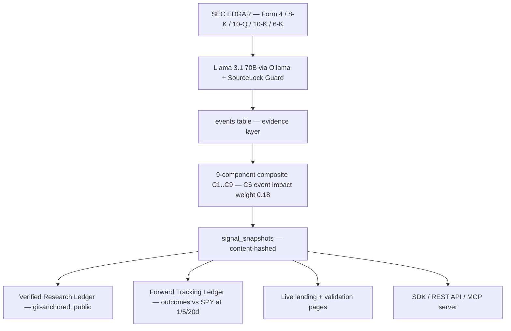

<div align="center">

# YUCLAW

**Open-Source Evidence-First Financial Research Platform**

[](https://opensource.org/licenses/MIT)
[](https://www.python.org/downloads/)
[](https://pypi.org/project/yuclaw)
[](https://nvidia.com)
[](https://github.com/YuClawLab/yuclaw-trust)

> Composite research signals tied to SEC filings, time-machine replay across
> a 90-day evidence window, and a public git-anchored Verified Research Ledger
> for tamper evidence. **Research and education only — not investment advice.**
> Signal labels are research classifications, not buy/sell recommendations.

[Live Dashboard](https://yuclawlab.github.io/yuclaw-brain) · [Quickstart](docs/getting-started/quickstart.md) · [Methodology](docs/methodology/backfill.md) · **[Disclaimer](DISCLAIMER.md)** · [API Terms](docs/API_TERMS.md) · [PyPI](https://pypi.org/project/yuclaw)

</div>

---

## Quick start

```bash
pip install yuclaw
python3 -m v3.cli why NVDA
```

Sample output:
```
NVDA composite score: +0.299  (signal label: NEUTRAL)

Components (score × weight × confidence):
  C1 Momentum        +0.46   (weight 0.12)
  C2 Volume          +0.00   (weight 0.08)
  C3 Sector          -0.15   (weight 0.12)
  C4 Macro           +0.60   (weight 0.15)
  C5 Oil/Rates/FX    -0.47   (weight 0.05)
  C6 Event Impact    +0.16   (weight 0.18)
  C7 Peer Corr       +0.95   (weight 0.10)
  C8 Cascade         +0.00   (weight 0.12)
  C9 Model Trust     +0.00   (weight 0.08)

Top contributing events (last 7 days):
  ↑  +0.02  2026-05-14  M_AND_A_CLOSE (d1 cascade)
              CASCADE d1 via HPE→NVDA(supply,w=0.15) from HPE: H3C divestiture
              source: https://www.sec.gov/Archives/edgar/data/1645590/...

Compliance: Research only. Not financial advice. Not a registered investment advisor.
```

## v3.0 command surface

```bash
python3 -m v3.cli why TICKER             # Composite signal + ranked evidence w/ SEC source URLs
python3 -m v3.cli replay TICKER --date DATE   # Point-in-time signal at end of date
python3 -m v3.cli validation             # In-sample event validation + forward tracking ledger
python3 -m v3.cli brief                  # Personalized digest (uses ~/.yuclaw/profile.json)
python3 -m v3.cli watch add TICKER       # Manage local watchlist
python3 -m v3.cli verify TICKER --date DATE   # Verified Research Ledger integrity check
python3 -m v3.cli profile show           # Local preferences
```

Public signal vocabulary: `STRONG_BULLISH`, `BULLISH`, `NEUTRAL`, `WATCH`, `WEAKENING`, `NEGATIVE_EVENT`, `BEARISH_WATCH`, `RISK_ALERT`. There is no `SELL` or `SHORT` label.

> **`yuclaw l2`**: real iceberg detection requires a Level-2 data feed.
> Without one, the command returns `N/A` instead of fabricated microstructure.

---

## Live dashboard

**[yuclawlab.github.io/yuclaw-brain](https://yuclawlab.github.io/yuclaw-brain)** — re-rendered daily after the close from the v3 pipeline.

---

## Signal Validation Lab

A Fama–French-style **decile-cohort event study** of whether YUCLAW's composite
score carries forward information — built from feedback by Prof. Deng Shijie
(Georgia Tech). It is **research cohort analysis, not portfolio management**:
cohorts are grouped by score decile or signal label (never by trade direction),
tracked as equal-weighted research cohorts, and only **derived statistics**
(returns, spreads, drawdowns) are shown — never raw prices. Two panels are kept
strictly separate: a look-ahead-free **Forward (OOS)** panel and an **In-Sample
Replay** panel (which carries an explicit parametric look-ahead disclosure). The
forward window is still early and is labelled "not yet statistically meaningful".
Live: [Signal Validation Lab](https://yuclawlab.github.io/yuclaw-brain/validation_lab.html) ·
Methodology: [`docs/methodology/validation_lab.md`](docs/methodology/validation_lab.md).
*Hypothetical research illustration — not investment advice, not performance advertising.*

---

## v5 — ClawFactory (in development)

v5 "ClawFactory" is an eleven-layer evidence-extraction architecture in
development. **Layer 0 (the durable, multi-node evidence job queue) is complete
and public** on branch [`v5-layer0-foundation`](https://github.com/YuClawLab/yuclaw-brain/tree/v5-layer0-foundation)
— proven on a 281-filing real-data backfill (281/281 succeeded, 0 dead-letter).
Target: July 1. No v5 feature beyond Layer 0 is built yet. Full roadmap (all
eleven layers + the three locked values):
[ClawFactory announcement](drafts/v4.2/clawfactory_announcement.md).

---

## What YUCLAW gives you

- **Evidence-first composite signals.** Every YUCLAW signal traces back to a verifiable SEC filing or deterministic supply-chain cascade — no opaque "model said so". The 9-component composite (momentum, volume, sector velocity, macro regime, oil/rates/FX, **event impact**, peer correlation, **supply-chain cascade**, model trust) is confidence-weighted; C6 event impact carries the highest single weight (0.18), by design.
- **SEC EDGAR ingestion + SourceLock Guard.** Form 4 / 8-K / 10-Q / 10-K / 6-K filings ingested via local Llama 3.1 70B (Ollama). A deterministic SourceLock Guard validates every LLM extraction against the source text before any signal sees it.
- **Time-machine replay.** Any signal can be recomputed as of a past date with point-in-time filtering (`available_as_of <= as_of`). Leak-audited; reproducible via the `yuclaw replay` CLI / REST `/replay` / MCP `yuclaw_replay`.
- **In-Sample Event Validation + Forward Tracking Ledger.** Two clearly separated panels: in-sample is replay-reconstructed (~1,000 snapshots over a 90-day window), forward is live-emitted from launch onward. Hit rates always reported alongside their `n` — never a headline percentage alone.
- **Verified Research Ledger.** Each day's signal hashes are committed to a public git repo ([yuclaw-trust](https://github.com/YuClawLab/yuclaw-trust)). Anyone can `yuclaw verify TICKER --date DATE` to confirm a signal hasn't been edited since publication. This verifies *record integrity and timing* — not investment merit.
- **Multi-surface access.** Python SDK (`pip install yuclaw`, import as `yuclaw_py`), REST API, FastMCP stdio server (7 tools), CLI (`yuclaw why / replay / validation / brief / watch / verify / profile`).
- **Local LLM inference.** Llama 3.1 70B (Q4_K_M, ~42 GB) via Ollama on NVIDIA DGX Spark GB10. Zero cloud LLM dependency for extraction. SEC EDGAR is the only external data source for the evidence layer.
- **~80-ticker universe.** Equities + sector ETFs + broad ETFs + macro instruments.

---

## Methodology and limitations

Full methodology lives in [`docs/methodology/backfill.md`](docs/methodology/backfill.md). The honest limits at launch:

- **In-sample is replay reconstruction, not a live backtest.** The In-Sample Event Validation panel was materialized after the fact by the replay engine — not emitted live.
- **Fresh-data pipeline (v4.2).** C1 momentum, C3 sector velocity, C5 (sector input), and C7 peer correlation now read **live `price_history`** (a daily yfinance feed restored 2026-06-10), so the price-derived components are current rather than reading a frozen cache. **C4 macro regime is temporarily frozen as of 2026-05-18 with a staleness disclosure, pending macro engine restoration** — its only upstream is the retired v2.3 macro engine and it cannot be price-derived without changing the component's math. C6 event impact, C8 cascade, and C9 model trust remain point-in-time exact. On historical replays the price-derived components still carry point-in-time caveats.
- **Forward Tracking Ledger starts at n=0.** Launch is Day 0. 1-day outcomes mature next trading day; 5-day a week later; 20-day a month later. The forward panel looks sparse for the first few weeks — correct, not a bug.
- **Extreme labels are rare by construction.** STRONG_BULLISH and BEARISH_WATCH require broad component agreement plus at least one material non-insider event. Day-0 OOS 99th percentile sits at +0.531, just below the +0.55 STRONG_BULLISH floor. See `docs/methodology/backfill.md` §8 for the full reachability analysis.

**No table of headline % returns appears in this README.** Hit rates in both panels are reported alongside their `n`; small-n panels are tagged "preliminary". See [`yuclawlab.github.io/yuclaw-brain/validation.html`](https://yuclawlab.github.io/yuclaw-brain/validation.html) for the live numbers.

---

## System architecture


```mermaid
graph TD
    A[SEC EDGAR — Form 4 / 8-K / 10-Q / 10-K / 6-K] --> B[Llama 3.1 70B via Ollama + SourceLock Guard]
    B --> C[events table — evidence layer]
    C --> D[9-component composite C1..C9 — C6 event impact weight 0.18]
    D --> E[signal_snapshots — content-hashed]
    E --> F[Verified Research Ledger — git-anchored, public]
    E --> G[Forward Tracking Ledger — outcomes vs SPY at 1/5/20d]
    E --> H[Live landing + validation pages]
    E --> I[SDK / REST API / MCP server]
```

### Directory structure (v3.0)

```
v3/
  signal/       9-component composite (C1..C9), supply-chain graph, cascade engine
  sources/      SEC EDGAR poller + backfill + Form 4 deterministic parser
  extract/      LLM extraction + SourceLock Guard
  replay/       Time-machine replay engine
  track/        price_history + outcome_updater + In-Sample Validation panels
  proof/        Verified Research Ledger writer + verifier
  radar/        Change detector + Telegram/Email/Slack adapters
  api/          FastAPI REST server
  mcp/          FastMCP stdio server (7 tools)
  cli/          why / replay / validation / brief / watch / verify / profile
  signal/healthcheck.py    Daily pipeline gate
sdk/            yuclaw — public SDK (pip install yuclaw)
docs/methodology/backfill.md  v3.0 methodology + limitations + leak audit
```

---

## Operations — what's actually scheduled

This is the live cron table as of v3.0.0. Frequencies are read from `crontab -l`, not aspirational.

| Engine | Frequency | What it does |
|:---|:---:|:---|
| **v3.0 daily pipeline** | weekdays 17:00 MDT | `healthcheck → snapshot_writer → outcome_updater → radar → proof.ledger → refresh_v3_pages` — single chained pipeline, `&&` short-circuits on failure |
| Ollama check | every 30 min | sanity ping to local Ollama |
| Health monitor | every 30 min | `/tmp/yuclaw_health.log` |
| Sentiment archive | every 4 hours | `output/sentiment/*.json` (research-side, orthogonal to v3.0) |
| Oil intelligence | hourly | `output/oil/YYYY-MM-DD_brief.json` (research-side) |
| Oil brief | nightly 23:00 MDT | LLM oil synthesis (research-side) |
| Swarm debate | nightly 23:00 MDT | Bull/Bear/Oracle LLM debate (research-side) |
| ATROS daemon | daily 18:15 MDT | alert + AutoDream summary (research-side, pre-v3.0) |
| PyTorch check | daily 22:00 MDT | dependency sanity |

v3.0 retired the v2.3.0 `refresh_dashboard.sh`, `nightly_score_refresh.sh`, and `yuclaw.telegram.broadcast_bot` cron lines. The single signal pipeline is now the daily 17:00 MDT chain above; Telegram broadcasts go through `v3.radar.run` to `@yuclaw_signals` when material changes are detected.

---

## Hardware

- **GPU**: NVIDIA Grace Blackwell GB10 (128 GB unified memory)
- **LLM**: Llama 3.1 70B (Q4_K_M, ~42 GB on GPU, 80 layers) served via
  Ollama. Exposed locally as the `nemotron-3-super-local` Ollama tag with a
  financial-analyst system prompt. The real Nemotron 3 Super 120B is wired
  in `yuclaw/core/router.py` as a dormant OpenRouter fallback (sm_121a-blocked
  on the vLLM path); the active production path uses Llama 3.1 70B locally.
- **Measured generation speed**: ~2.2–2.7 tok/s on 50-token completions
  (rendered live in the dashboard's TOK/S stat card — `output/inference_stats.json`
  is rewritten by every nightly cron run).
- **Signal cycle**: ~39 s end-to-end for the score-regeneration pipeline.

---

## OpenClaw integration

```bash
# As an OpenClaw skill
bash <(curl -s https://raw.githubusercontent.com/YuClawLab/yuclaw-brain/main/yuclaw/openclaw/install.sh)

# Or as MCP server
python3 yuclaw/openclaw/mcp_server.py     # listens on port 8002
```

---

## Community

| | |
|:---|:---|
| Dashboard | [yuclawlab.github.io/yuclaw-brain](https://yuclawlab.github.io/yuclaw-brain) |
| Twitter | [@Vincenzhang2026](https://twitter.com/Vincenzhang2026) |
| GitHub | [YuClawLab](https://github.com/YuClawLab) |
| PyPI | [pypi.org/project/yuclaw](https://pypi.org/project/yuclaw) |
| Methodology (v3.0) | [docs/methodology/backfill.md](docs/methodology/backfill.md) |

---

## ⚠️ Disclaimer

YUCLAW is open-source research and educational software. **It is NOT
financial advice, investment advice, or a recommendation to buy, sell, or
hold any security.** All signals, scores, and analyses are generated by
automated AI models and may contain errors.

Past performance does not guarantee future results. Trading involves
substantial risk of loss. You are solely responsible for your own
investment decisions. Consult a licensed financial advisor before making
any investment.

YuClawLab, its contributors, and affiliates accept no liability for any
losses arising from use of this software.

*For educational and research purposes only. MIT Licensed.*

See [`docs/methodology/backfill.md`](docs/methodology/backfill.md) and
[`DISCLAIMER.md`](DISCLAIMER.md) for the long-form versions.

---

<div align="center">

Released under the **MIT License** — free for everyone.

*Built on NVIDIA DGX Spark GB10 · Llama 3.1 70B via Ollama · Local inference · Git-anchored [Verified Research Ledger](https://github.com/YuClawLab/yuclaw-trust)*

**[pip install yuclaw](https://pypi.org/project/yuclaw)**

</div>
