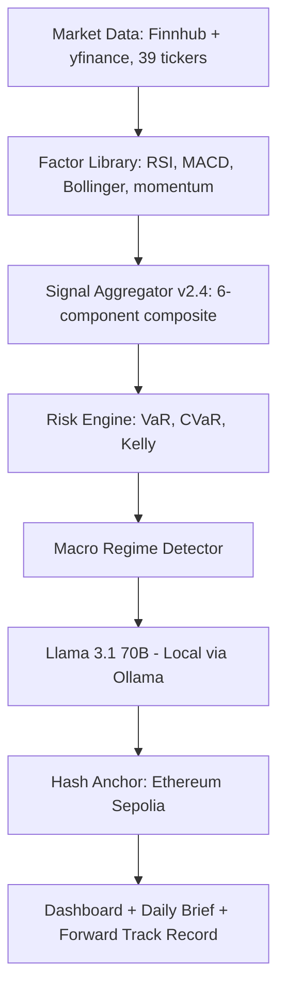

<div align="center">

# YUCLAW

**Open-Source Evidence-First Financial Research Platform**

[](https://opensource.org/licenses/MIT)
[](https://www.python.org/downloads/)
[](https://pypi.org/project/yuclaw-py)
[](https://nvidia.com)
[](https://github.com/YuClawLab/yuclaw-trust)

> Composite research signals tied to SEC filings, time-machine replay across
> a 90-day evidence window, and a public git-anchored Verified Research Ledger
> for tamper evidence. **Research and education only — not investment advice.**
> Signal labels are research classifications, not buy/sell recommendations.

[Live Dashboard](https://yuclawlab.github.io/yuclaw-brain) · [Quickstart](docs/getting-started/quickstart.md) · [Methodology](docs/methodology/backfill.md) · **[Disclaimer](DISCLAIMER.md)** · [API Terms](docs/API_TERMS.md) · [PyPI](https://pypi.org/project/yuclaw-py)

</div>

---

## Quick start

```bash
pip install yuclaw-py
python3 -m v3.cli why NVDA
```

Sample output:
```
NVDA composite score: +0.299  (signal label: NEUTRAL)

Components (score × weight × confidence):
  C1 Momentum        +0.46   (weight 0.12)
  C2 Volume          +0.00   (weight 0.08)
  C3 Sector          -0.15   (weight 0.12)
  C4 Macro           +0.60   (weight 0.15)
  C5 Oil/Rates/FX    -0.47   (weight 0.05)
  C6 Event Impact    +0.16   (weight 0.18)
  C7 Peer Corr       +0.95   (weight 0.10)
  C8 Cascade         +0.00   (weight 0.12)
  C9 Model Trust     +0.00   (weight 0.08)

Top contributing events (last 7 days):
  ↑  +0.02  2026-05-14  M_AND_A_CLOSE (d1 cascade)
              CASCADE d1 via HPE→NVDA(supply,w=0.15) from HPE: H3C divestiture
              source: https://www.sec.gov/Archives/edgar/data/1645590/...

Compliance: Research only. Not financial advice. Not a registered investment advisor.
```

## v3.0 command surface

```bash
python3 -m v3.cli why TICKER             # Composite signal + ranked evidence w/ SEC source URLs
python3 -m v3.cli replay TICKER --date DATE   # Point-in-time signal at end of date
python3 -m v3.cli validation             # In-sample event validation + forward tracking ledger
python3 -m v3.cli brief                  # Personalized digest (uses ~/.yuclaw/profile.json)
python3 -m v3.cli watch add TICKER       # Manage local watchlist
python3 -m v3.cli verify TICKER --date DATE   # Verified Research Ledger integrity check
python3 -m v3.cli profile show           # Local preferences
```

Public signal vocabulary: `STRONG_BULLISH`, `BULLISH`, `NEUTRAL`, `WATCH`, `WEAKENING`, `NEGATIVE_EVENT`, `BEARISH_WATCH`, `RISK_ALERT`. There is no `SELL` or `SHORT` label.

> **`yuclaw l2`**: real iceberg detection requires a Level-2 data feed.
> Without one, the command returns `N/A` instead of fabricated microstructure.

---

## Live dashboard

**[yuclawlab.github.io/yuclaw-brain](https://yuclawlab.github.io/yuclaw-brain)** — refreshes every 30 minutes from cron.

---

## What YUCLAW gives you

- **Real signals** — factor-scored buy/sell across a **39-ticker universe**
  (leveraged ETFs blocklisted to avoid distorting momentum).
- **Backtest engine** — strategy backtest output in `output/backtest_all.json`,
  with explicit limitations documented in
  [`docs/methodology/backtest.md`](docs/methodology/backtest.md).
- **Hash-anchored audit trail** — selected signal-decision hashes anchored on
  Ethereum Sepolia testnet by the ZKP module. See
  [yuclaw-trust](https://github.com/YuClawLab/yuclaw-trust) for the honest
  framing of what's hash-only vs. zk-SNARK.
- **Local LLM inference** — Llama 3.1 70B (Q4_K_M, 42 GB) via Ollama on
  NVIDIA DGX Spark GB10, configured locally as the `nemotron-3-super-local`
  Ollama tag with a financial-analyst system prompt. **Zero cloud LLM
  dependency.** (Note: Finnhub is used as the cloud price/news data source.
  Real Nemotron 3 Super 120B via OpenRouter is wired in `yuclaw/core/router.py`
  as a dormant fallback path; activate by setting `OPENROUTER_API_KEY`.)
- **Macro regime detector** — CRISIS / RISK_OFF / RISK_ON classification from
  SPY/TLT/GLD/UUP momentum.
- **Alpaca paper-trading bridge** — `yuclaw paper` ships with seven safety
  nets (paper-URL guard, validation ping, market-hours check, $10K notional
  cap, first-run consent, append-only audit log, drawdown kill switch).
- **Forward track record** — `cron/track_record_builder.sh` writes a fresh
  daily entry to `output/track_record/dayN.json` after market close.

---

## Methodology and limitations

The dashboard's **BACKTEST RESULTS** card and the `yuclaw track` command both
read from a pipeline whose limitations are documented in
[`docs/methodology/backtest.md`](docs/methodology/backtest.md). In short:

- The forward track record (`track_record_latest.json`) currently captures
  entry price = signal-time price, but the entry-price-vs-current-price
  comparison assumes zero transaction cost and zero slippage.
- The strategy backtest (`engines/run_backtest.py`) produces a Calmar metric
  on historical close-to-close returns. It does not model bid/ask, fills,
  partials, or financing costs.
- Anyone reading a single accuracy or Calmar number on the dashboard should
  read the methodology page before drawing inferences.

**No table of headline % returns appears in this README.** The
"verified backtest results" panel on the dashboard is currently a neutral
placeholder pending live computation from `track_record_verified.json` (see
that file's known schema mismatch — being addressed).

---

## System architecture


```mermaid
graph TD
    A[Market Data: Finnhub + yfinance, 39 tickers] --> B[Factor Library: RSI, MACD, Bollinger, momentum]
    B --> C[Signal Aggregator v2.4: 6-component composite]
    C --> D[Risk Engine: VaR, CVaR, Kelly]
    D --> E[Macro Regime Detector]
    E --> F[Llama 3.1 70B - Local via Ollama]
    F --> G[Hash Anchor: Ethereum Sepolia]
    G --> H[Dashboard + Daily Brief + Forward Track Record]
```

### Directory structure

```
yuclaw/
  modules/       Signal aggregator, macro regime detection, sector rotation
  factors/       Factor library — RSI, MACD, Bollinger
  risk/          VaR, CVaR, Kelly criterion
  brain/         Evidence Graph v2, financial NER
  edge/          Broker gateways (Alpaca REST today, FIX-via-yuclaw-edge planned)
  daemon/        ATROS: alerts + AutoDream daily synthesis
  oil/           Oil intelligence (EIA + LLM brief)
  utils/         Inference-speed measurement, helpers
  trust/         ZKP module (hash anchors today; zk-SNARK on roadmap)
  openclaw/      OpenClaw skill + MCP server
docs/methodology/  Backtest methodology disclosure
cron/            Scheduled engines (see Operations table below)
engines/         Strategy backtest, factor scan, screener
```

---

## Operations — what's actually scheduled

This is the live cron table as of v2.3.0. Frequencies are read from
`crontab -l`, not aspirational.

| Engine | Frequency | Output |
|:---|:---:|:---|
| Dashboard refresh | every 30 min | `docs/index.html` (auto-pushed) |
| Health monitor | every 30 min | `/tmp/yuclaw_health.log` |
| Ollama check | every 30 min | sanity ping to local Ollama |
| Sentiment archive | every 4 hours | `output/sentiment/*.json` |
| Oil intelligence | hourly | `output/oil/YYYY-MM-DD_brief.json` |
| Swarm debate | nightly 23:00 MDT | `output/swarm/YYYY-MM-DD.json` |
| Nightly score regeneration | weekdays 18:00 MDT | aggregator + sector + earnings |
| ATROS daemon | daily 18:15 MDT | alert + AutoDream summary |
| Track record | daily 16:30 MDT | `output/track_record/dayN.json` |
| PyTorch check | daily 22:00 MDT | dependency sanity |
| Oil brief | nightly 23:00 MDT | LLM oil synthesis |

Modules **not currently in active cron** but present in the codebase:
Dark Pool engine, evidence graph v2, FinSkills marketplace, YCT governance
token. These are research modules — outputs in `output/` exist but are not
auto-refreshed.

---

## Hardware

- **GPU**: NVIDIA Grace Blackwell GB10 (128 GB unified memory)
- **LLM**: Llama 3.1 70B (Q4_K_M, ~42 GB on GPU, 80 layers) served via
  Ollama. Exposed locally as the `nemotron-3-super-local` Ollama tag with a
  financial-analyst system prompt. The real Nemotron 3 Super 120B is wired
  in `yuclaw/core/router.py` as a dormant OpenRouter fallback (sm_121a-blocked
  on the vLLM path); the active production path uses Llama 3.1 70B locally.
- **Measured generation speed**: ~2.2–2.7 tok/s on 50-token completions
  (rendered live in the dashboard's TOK/S stat card — `output/inference_stats.json`
  is rewritten by every nightly cron run).
- **Signal cycle**: ~39 s end-to-end for the score-regeneration pipeline.

---

## OpenClaw integration

```bash
# As an OpenClaw skill
bash <(curl -s https://raw.githubusercontent.com/YuClawLab/yuclaw-brain/main/yuclaw/openclaw/install.sh)

# Or as MCP server
python3 yuclaw/openclaw/mcp_server.py     # listens on port 8002
```

---

## Community

| | |
|:---|:---|
| Dashboard | [yuclawlab.github.io/yuclaw-brain](https://yuclawlab.github.io/yuclaw-brain) |
| Twitter | [@Vincenzhang2026](https://twitter.com/Vincenzhang2026) |
| GitHub | [YuClawLab](https://github.com/YuClawLab) |
| PyPI | [pypi.org/project/yuclaw](https://pypi.org/project/yuclaw) |
| Methodology | [docs/methodology/backtest.md](docs/methodology/backtest.md) |

---

## ⚠️ Disclaimer

YUCLAW is open-source research and educational software. **It is NOT
financial advice, investment advice, or a recommendation to buy, sell, or
hold any security.** All signals, scores, and analyses are generated by
automated AI models and may contain errors.

Past performance does not guarantee future results. Trading involves
substantial risk of loss. You are solely responsible for your own
investment decisions. Consult a licensed financial advisor before making
any investment.

YuClawLab, its contributors, and affiliates accept no liability for any
losses arising from use of this software.

*For educational and research purposes only. MIT Licensed.*

See [`docs/methodology/backtest.md`](docs/methodology/backtest.md) and
[`DISCLAIMER.md`](DISCLAIMER.md) for the long-form versions.

---

<div align="center">

Released under the **MIT License** — free for everyone.

*Built on NVIDIA DGX Spark GB10 · Llama 3.1 70B via Ollama · Local inference · Hash-anchored on Ethereum Sepolia*

**[pip install yuclaw](https://pypi.org/project/yuclaw)**

</div>
